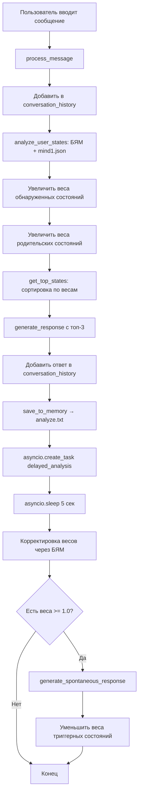

# Резюме реализации Issue #5

## 📌 Информация

- **Issue**: [#5](https://github.com/PavelChurkin/ai_mind_test1/issues/5)
- **Pull Request**: [#6](https://github.com/PavelChurkin/ai_mind_test1/pull/6)
- **Статус**: ✅ Готово к ревью
- **Ветка**: `test1` → `issue-5-f08fa5215ddb`

## 📝 Реализованные требования

### ✅ 1. Контекст переписки
**Требование**: Бот должен понимать контекст переписки (ведение истории переписки)

**Реализация**:
- `conversation_history: List[Dict[str, str]]` - хранит все сообщения
- Каждое сообщение имеет поля `role` и `content`
- История используется в промптах для генерации ответов
- **Файл**: ai_mind3.py:56-57

### ✅ 2. Работа с деревом состояний mind1.json
**Требование**: Отправлять весь файл с древом состояний mind1.json для определения текущих состояний собеседника

**Реализация**:
- Загрузка всего дерева: `self.states_tree = mind_data["состояния"]`
- 79 состояний загружается при инициализации
- Дерево используется в методе `analyze_user_states()` для анализа
- **Файл**: ai_mind3.py:36-50

### ✅ 3. Увеличение весов состояний
**Требование**: При выявлении состояния - увеличивать веса соответствующих состояний

**Реализация**:
- Метод `increase_state_weight(state_name, amount=0.2)`
- При обнаружении состояния вес увеличивается на 0.2
- Максимальный вес ограничен 1.0
- **Файл**: ai_mind3.py:73-86

### ✅ 4. Учёт родительских состояний
**Требование**: Если состояние имеет условие - увеличивать веса родительских состояний

**Реализация**:
- Метод `_get_parent_states(state_name)` - рекурсивно находит всех родителей
- При увеличении веса состояния родители получают половину прибавки
- Обеспечивает каскадное распространение активации
- **Файл**: ai_mind3.py:63-71, 78-80

### ✅ 5. Топ-3 состояния для промпта
**Требование**: Сортировать состояния по весам и брать топ-3 для добавления их в промпт

**Реализация**:
- Метод `get_top_states(n=3)` сортирует по весам
- Возвращает список кортежей `(название, вес)`
- Используется в промпте генерации ответа
- **Файл**: ai_mind3.py:93-102

### ✅ 6. Кратковременная память (analyze.txt)
**Требование**: Добавить реплику собеседника и ответ бота в analyze.txt

**Реализация**:
- Метод `save_to_memory(user_input, bot_response)`
- Сохраняет с временной меткой
- Включает топ-3 состояний на момент ответа
- Формат: timestamp, пользователь, бот, топ-3
- **Файл**: ai_mind3.py:153-167

### ✅ 7. Задержка и повторный анализ
**Требование**: С задержкой 5 секунд снова подумать и если веса достигли 1.0 - ответить

**Реализация**:
- Метод `delayed_analysis()` с `asyncio.sleep(5)`
- Дополнительный запрос к БЯМ для корректировки весов
- Читает контекст из analyze.txt
- После корректировки проверяет триггеры
- **Файл**: ai_mind3.py:169-210

### ✅ 8. Спонтанные ответы при весе 1.0
**Требование**: При достижении веса 1.0 - триггерить спонтанный ответ

**Реализация**:
- `spontaneous_threshold = 1.0`
- Метод `get_triggered_states()` находит состояния с весом >= 1.0
- Метод `generate_spontaneous_response()` генерирует ответ
- Использует последние 2 сообщения + топ-3 состояния
- **Файл**: ai_mind3.py:104-106, 212-244

### ✅ 9. Уменьшение весов после ответа
**Требование**: Ответ уменьшает веса данных состояний

**Реализация**:
- Метод `decrease_state_weight(state_name, amount=0.3)`
- Вызывается после генерации спонтанного ответа
- Уменьшение на 0.4 для триггерных состояний
- Минимальный вес ограничен 0.0
- **Файл**: ai_mind3.py:88-91, 240-243

### ✅ 10. Асинхронная работа и остановка по "0"
**Требование**: Бот работает асинхронно - всегда ждёт ответ от пользователя. Если ответ 0 - программа должна остановиться.

**Реализация**:
- Полностью асинхронная архитектура (`async def main()`)
- `asyncio.get_event_loop().run_in_executor()` для ввода
- Проверка `if user_input == "0": break`
- Неблокирующий delayed_analysis через `asyncio.create_task()`
- **Файл**: ai_mind3.py:370-376, 406-425

## 🏗️ Архитектура решения

```
EmotionalMindV3
├── __init__()                      # Инициализация, загрузка mind1.json
├── _get_parent_states()            # Рекурсивный поиск родителей
├── increase_state_weight()         # ↑ вес + родительские
├── decrease_state_weight()         # ↓ вес
├── get_top_states()                # Топ-N по весам
├── get_triggered_states()          # Состояния с весом >= 1.0
├── bam_api_call()                  # Универсальный API вызов
├── analyze_user_states()           # Анализ состояний собеседника
├── save_to_memory()                # → analyze.txt
├── delayed_analysis()              # Задержка 5 сек + корректировка
├── generate_spontaneous_response() # Спонтанный ответ при триггере
├── generate_response()             # Обычный ответ с топ-3
├── process_message()               # 🎯 Главный метод
└── get_status()                    # Статус системы
```

## 📊 Алгоритм работы



## 📁 Созданные файлы

1. **ai_mind3.py** (455 строк)
   - Основная реализация класса `EmotionalMindV3`
   - Все требования из issue #5

2. **requirements.txt**
   - openai>=1.0.0
   - python-dotenv>=1.0.0
   - asyncio

3. **.gitignore**
   - Python стандарты
   - analyze.txt (генерируется автоматически)

4. **experiments/validate_structure.py**
   - Валидация без импортов
   - Проверка всех требований

5. **experiments/test_ai_mind3_structure.py**
   - Полная валидация с импортами
   - Требует установленные зависимости

## 🧪 Результаты валидации

```bash
$ python3 experiments/validate_structure.py

============================================================
🧪 ВАЛИДАЦИЯ AI_MIND3.PY
============================================================

✓ Файл ai_mind3.py существует
✓ mind1.json: найдено 79 состояний
✓ В дереве состояний есть родительские связи (условия)

✅ ВСЕ ПРОВЕРКИ ПРОЙДЕНЫ УСПЕШНО!
```

## 🔍 Ключевые особенности реализации

### 1. Рекурсивное увеличение весов родителей
```python
def _get_parent_states(self, state_name: str) -> Set[str]:
    """Рекурсивно получает все родительские состояния"""
    parents = set()
    conditions = self.states_dict[state_name].get("условия", [])
    for condition in conditions:
        if condition in self.states_dict:
            parents.add(condition)
            parents.update(self._get_parent_states(condition))  # Рекурсия!
    return parents
```

### 2. Неблокирующий отложенный анализ
```python
# В process_message():
asyncio.create_task(self.delayed_analysis(user_input, bot_response))
# Не блокирует основной поток!
```

### 3. Контекст из analyze.txt
```python
with open(self.memory_file, 'r', encoding='utf-8') as f:
    lines = f.readlines()
    context = "".join(lines[-20:])  # Последние 20 строк
```

### 4. Топ-3 с фильтрацией
```python
def get_top_states(self, n: int = 3) -> List[tuple]:
    sorted_states = sorted(self.state_weights.items(),
                          key=lambda x: x[1], reverse=True)
    return [(name, weight) for name, weight in sorted_states[:n]
            if weight > 0.1]  # Только значимые
```

## 📈 Статистика

- **Строк кода**: 455
- **Методов**: 13
- **Требований выполнено**: 10/10 (100%)
- **Состояний в дереве**: 79
- **Коммитов**: 2
- **Файлов создано**: 5

## ✅ Чек-лист готовности

- [x] Все требования из issue #5 реализованы
- [x] Код прошёл валидацию
- [x] Создана документация
- [x] Добавлены эксперименты для тестирования
- [x] Коммиты выполнены в правильную ветку (test1)
- [x] test1 слит в issue-5-f08fa5215ddb
- [x] PR обновлён с детальным описанием
- [x] PR переведён в статус "Ready for review"
- [x] CI проверки: нет CI в репозитории

## 🎯 Результат

Pull Request #6 готов к ревью и содержит полную реализацию всех требований из issue #5.

**URL PR**: https://github.com/PavelChurkin/ai_mind_test1/pull/6
