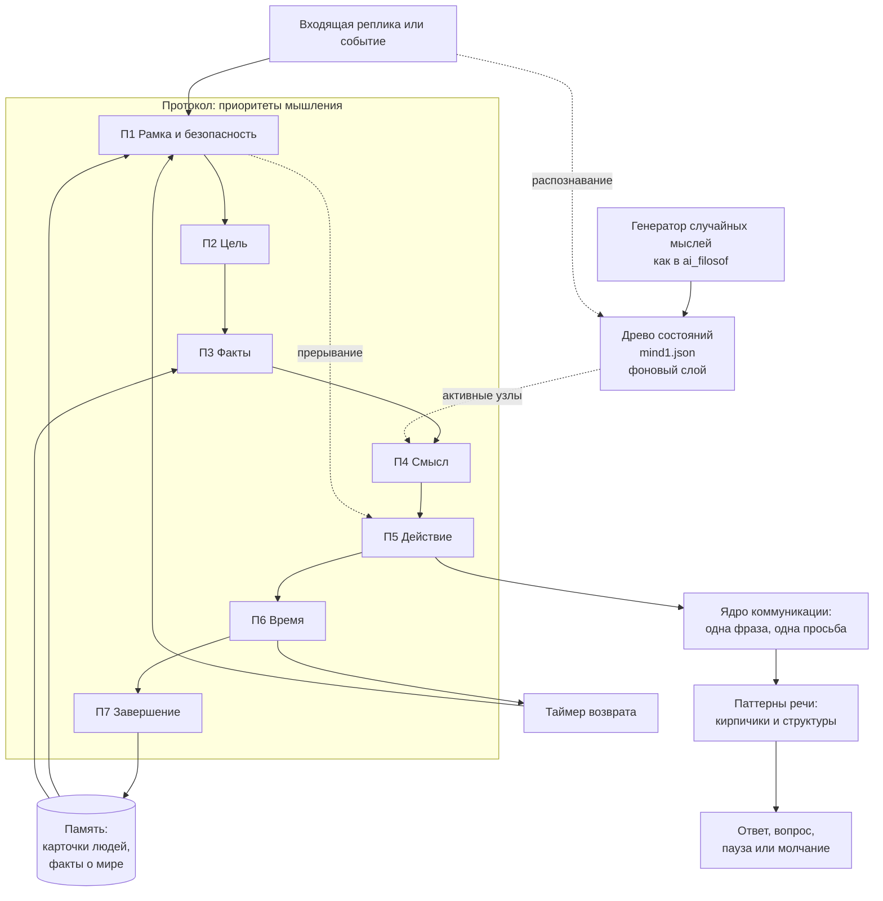

# Отчёт от 2026-10-04: архитектура мышления и чего не хватает в древе

> Контекст: [задача #9](https://github.com/PavelChurkin/ai_mind_test1/issues/9).
> Источники: [исходный документ DeepSeek](Исходник%20—%20ускорение%20мышления%20%28DeepSeek%29.md),
> древо состояний [`mind1.json`](../mind1.json), бот [`ai_mind3.py`](../ai_mind3.py),
> проект [ai_filosof](https://github.com/PavelChurkin/ai_filosof).
> Документ без кода: только анализ, выводы и предложения для будущей разработки.

## Содержание

1. [Краткий вывод](#1-краткий-вывод)
2. [Что сделал DeepSeek и что в этом ценного](#2-что-сделал-deepseek-и-что-в-этом-ценного)
3. [Где документ DeepSeek неточен или противоречив](#3-где-документ-deepseek-неточен-или-противоречив)
4. [Что есть в древе сейчас — факты](#4-что-есть-в-древе-сейчас--факты)
5. [Чего не хватает в древе](#5-чего-не-хватает-в-древе)
6. [Как сложить всё в одну архитектуру](#6-как-сложить-всё-в-одну-архитектуру)
7. [Мысли по поводу идей автора](#7-мысли-по-поводу-идей-автора)
8. [Риски и этические ограничения](#8-риски-и-этические-ограничения)
9. [Что делать дальше (дорожная карта без кода)](#9-что-делать-дальше-дорожная-карта-без-кода)
10. [Источники из когнитивистики](#10-источники-из-когнитивистики)

---

## 1. Краткий вывод

**Древо `mind1.json` отвечает на вопрос «что происходит в голове», но не отвечает на вопросы «в каком порядке», «зачем» и «что с этим делать».**

DeepSeek по сути предложил второй, управляющий слой поверх древа:

| Слой | Вопрос | Что это | Где описано |
|------|--------|---------|-------------|
| **Древо состояний** | *Что* я сейчас думаю/чувствую? | Карта содержимого мышления (79 состояний) | [`mind1.json`](../mind1.json) |
| **Приоритеты мышления** | *В каком порядке* обрабатывать? | Порядок обхода / планировщик внимания | [Приоритеты мышления](Приоритеты%20мышления.md) |
| **Ядро коммуникации** | *Зачем* этот контакт и *что* я хочу? | Цель и рамка разговора | [Ядро коммуникации](Ядро%20коммуникации.md) |
| **Паттерны речи** | *Как* это сказать быстро? | Готовые «кирпичики» и шаблоны фраз | [Паттерны речи](Паттерны%20речи.md) |
| **Память на людей** | *С кем* я говорю и что хотел? | Карточки-якоря на каждого собеседника | [Ядро коммуникации, раздел 6](Ядро%20коммуникации.md#6-память-на-людей-карточка-якорь) |

Главная мысль документа DeepSeek — **«скорость мышления — это не быстрее думать, а быстрее выбирать, что думать»** — хорошо ложится на машинную архитектуру: для бота «тупить» означает перебирать слишком много равнозначных веток древа без правила выбора. Сейчас в `ai_mind3.py` единственное правило выбора — «топ-3 по весу». Приоритеты дают второе, более осмысленное правило: **сначала рамка и цель, потом факты и смысл, потом действие**.

Именно поэтому древо и протокол не конкурируют, а дополняют друг друга: древо — это **карта**, приоритеты — это **маршрут**, ядро коммуникации — **пункт назначения**.

---

## 2. Что сделал DeepSeek и что в этом ценного

Перечислю по пунктам, что действительно полезно для проекта (а не только для человека, которому был адресован ответ).

1. **Диагноз медленного мышления — три причины.** Нет приоритета, нет «зачем», нет внешней опоры. Для бота это переводится буквально:
   - *нет приоритета* → все узлы древа равноправны, выбор только по весу;
   - *нет «зачем»* → у бота нет цели разговора, он реагирует, но ничего не хочет;
   - *нет внешней опоры* → память бота — это плоский `analyze.txt`, без структуры по людям и темам.
2. **Ядро из пяти вопросов** (цель → знания → чувство → фраза → просьба). Это компактный «контракт» каждого ответа бота. Подробно развито в [Ядре коммуникации](Ядро%20коммуникации.md).
3. **Семь приоритетов** (рамка → цель → факты → смысл → действие → время → завершение). Это ровно то, чего не хватает древу, — **порядок обхода**. Подробно с примерами — в [Приоритетах мышления](Приоритеты%20мышления.md).
4. **Паттерны речи и «кирпичики».** 16 кирпичиков и 7 структур (ННО, «тезис—аргумент—пример—вывод» и др.) — готовый словарь выходного слоя. Развито в [Паттернах речи](Паттерны%20речи.md).
5. **Память на людей через якоря** («человек → роль → тема → один вопрос → одна просьба»). Это готовая схема долговременной памяти бота о собеседниках.
6. **Шесть новых типов узлов** для древа: *Приоритет, Якорь, Один шаг, Метка, Возврат, Завершение*. Это ключевая находка: эти узлы — **не состояния**, а **операции над состояниями**. Подробнее в [разделе 5](#5-чего-не-хватает-в-древе).
7. **Набор приёмов из когнитивистики** (chunking, ограничение выбора, контекстная память, метакогниция и т. д.) — у большинства есть научная основа, см. [раздел 10](#10-источники-из-когнитивистики).

---

## 3. Где документ DeepSeek неточен или противоречив

Чтобы не принимать ответ языковой модели на веру, я сверил его с репозиторием и с самим собой.

### 3.1. Ссылки на узлы, которых нет в `mind1.json`

DeepSeek пишет «это ваш узел …» про следующие названия:

- «наличие и отсутствие фактов»,
- «Поиск критериев интереса»,
- «просьба / требование»,
- «управление / неуправление»,
- «перспектива во времени»,
- «Начало / конец»,
- «Пауза / продолжение».

**Ни одного из этих узлов нет в `mind1.json`** (проверено: в файле 79 состояний, ни одно не совпадает с этими названиями). Возможны два объяснения: (а) автор давал DeepSeek другой, более полный список узлов, которого нет в репозитории; (б) DeepSeek додумал названия. Если верно (а) — стоит добавить этот список в репозиторий, потому что он, судя по названиям, закрывает часть пробелов, описанных ниже. Если верно (б) — эти названия всё равно полезны как кандидаты в новые узлы (см. [5.2](#52-новые-ветви-состояний)).

### 3.2. Чувства выпали из приоритетов

Ядро из 5 вопросов содержит вопрос **«Что я чувствую?»**, а 7 приоритетов — **нет уровня «Чувство»**. Сопоставление:

| Вопрос ядра | Приоритет |
|-------------|-----------|
| 1. Чего я хочу? | 2. Цель |
| 2. Что я знаю? | 3. Факты |
| 3. Что я чувствую? | **— (нет)** |
| 4. Что я хочу сказать? | 5. Действие (речевое) |
| 5. Что должен сделать человек? | 5. Действие / 6. Время |

Это не просто недосмотр — это **место стыковки древа и протокола**. Древо `mind1.json` — это и есть «что я чувствую» (Тревога, Сожаление, Гнев, Любопытство…). Предлагаю считать, что древо работает **фоном, параллельно всем приоритетам**, а в момент «Смысл» (приоритет 4) его текущие активные узлы обязательно учитываются: «какие ценности затронуты» = «какие состояния сейчас самые тяжёлые». Подробнее в [Приоритетах мышления](Приоритеты%20мышления.md#фоновый-слой-чувства-древо-состояний).

### 3.3. Правило «не переходить дальше, пока не закрыт уровень» слишком жёсткое

В живом разговоре строгая последовательность сама становится причиной «тупления»: пока вы выясняете рамку, собеседник уже ушёл. Предлагаю две поправки:

- **Быстрый путь.** Если уровень очевиден (рамка ясна, цель известна заранее), он закрывается мгновенно, «по умолчанию». Протокол — это не 7 шагов каждый раз, а 7 **проверок**, большинство из которых проходят за доли секунды.
- **Прерывание по безопасности.** Приоритет 1 (рамка/безопасность) должен уметь **прерывать** любой другой уровень — как прерывание в операционной системе. Если посреди обсуждения фактов собеседник пишет что-то тревожное («мне незачем жить»), бот обязан немедленно вернуться на уровень 1, а не «закрывать» уровень 3.

### 3.4. Документ адресован человеку, а не боту

Тон ответа терапевтический («почему вы тупите»). Для проекта важно перевести каждую рекомендацию в **функцию архитектуры**. Например, «пауза как навык» для бота — это не «мне нужно время», а **право не отвечать сразу** и отложенный ответ (в `ai_mind3.py` уже есть задатки: отложенный анализ через 5 секунд и спонтанные ответы при весе 1.0).

---

## 4. Что есть в древе сейчас — факты

Проверено по файлу [`mind1.json`](../mind1.json) и коду [`ai_mind3.py`](../ai_mind3.py):

- **79 состояний**, один корень — **«Пустота»**, у неё три ребёнка: **Сожаление, Уточнение, Тревога**.
- **54 листа** (состояния без потомков) — древо широкое и неглубокое.
- Только у двух состояний несколько родителей: **«Сравнение»** (Сожаление, Тревога, Объективизация) и **«Игра»** (Любопытство, О грёзах). То есть это почти чистое дерево, а не сеть ассоциаций.
- У всех состояний `"вес": 0.0` — **статических свойств нет**, только динамический вес.
- В `ai_mind3.py` (метод `analyze_user_states`) в промпт передаётся только `all_states[:50]` — **первые 50 состояний из 79**. Оставшиеся 29 языковая модель **никогда не видит** и поэтому не может распознать:
  > Преемственность, Статуса, Вывод, Смирение, Признание, **Любопытство**, Голод, **Любовь**, **Игра**, Чем…–тем…, До или после, Для того чтобы, Потому что, Уже или ещё, Всё или ничего, Всегда или никогда, Каким образом, Если…–то…, Цикла, Процесса или действия, Следующий раз, Снова или опять, Частота, Мой, Свой, Чужой, Эго, **Благодарность**, Месть.

  Это важная находка: **практически вся «тёплая» часть древа (любопытство, любовь, игра, благодарность, признание) и вся ветвь причинно-следственного мышления отрезаны от бота.** Бот-эмпат, который не может распознать благодарность и любопытство, видит мир смещённым в сторону тревоги и сожаления. Это стоит исправить отдельной задачей (в рамках этой задачи код не трогаю — по условию).
- Один и тот же словарь весов используется и для **состояний собеседника** (их распознаёт анализ), и для **спонтанных реплик бота** (они генерируются из тех же весов). Фактически бот «чувствует» то, что распознал у собеседника, — это **зеркало**, а не собственная личность.

---

## 5. Чего не хватает в древе

Разделю на три группы: (5.1) новые **типы** узлов — операции, а не состояния; (5.2) новые **ветви** состояний; (5.3) новые **свойства** узлов.

### 5.1. Узлы-операции (управляющий слой)

DeepSeek предложил шесть; я бы добавил ещё четыре. Все они — не «что я чувствую», а «что я делаю со своими чувствами и мыслями».

| Узел-операция | Что делает | Откуда | Пример для бота |
|---|---|---|---|
| **Приоритет** | Задаёт порядок обхода: рамка → цель → факты → смысл → действие → время → завершение | DeepSeek | Сначала понять, кто пишет и зачем, а не сразу генерировать сочувствие |
| **Якорь** | Связывает человека / место / слово с одной темой и одним вопросом | DeepSeek | Увидел имя «Аня» → вспомнил «спросить, как прошёл экзамен» |
| **Один шаг** | Ограничивает действие одним элементом | DeepSeek | В ответе — одна просьба или один вопрос, не три |
| **Метка** | Называет текущее состояние словами («это тревога») | DeepSeek | «Похоже, тебя это тревожит» — так бот показывает, что понял |
| **Возврат** | Проверка через минуту / час / вечер | DeepSeek | Через день: «Ты вчера переживал из-за собеседования — как прошло?» |
| **Завершение** | Фиксирует, что решено и что дальше | DeepSeek | «Итак, ты решил поговорить с ним в пятницу» |
| **Цель** *(новое)* | Хранит «зачем» текущего контакта | Ядро, вопрос 1 | Цель: «Контакт» (поддержать), а не «Информация» |
| **Модель собеседника** *(новое)* | Отдельно хранит состояния *другого*, отдельно — *свои* | Теория психического (theory of mind) | «Он злится» ≠ «я злюсь» |
| **Порог ответа** *(новое)* | Решает: отвечать сейчас, позже или промолчать | README проекта («мы сначала обдумываем, нужно ли нам отвечать») | Не отвечать на «ок» развёрнутым сочувствием |
| **Выход / Покой** *(новое)* | Возвращает систему в «Пустоту» осознанно, а не только через затухание весов | См. ниже | Тема закрыта → веса связанной ветви сбрасываются |

### 5.2. Новые ветви состояний

Древо сейчас **реактивное и смещено в сторону тяжёлых состояний**: из «Пустоты» выходят только Сожаление, Тревога и Уточнение. Позитивная ветвь одна и глубоко спрятана (Уточнение → Очарование → Любопытство → Голод / Любовь / Игра). Для бота-эмпата и психолога не хватает:

1. **Ветвь эмпатии (о другом человеке).**
   *Сопереживание → Забота → Поддержка*, *Сочувствие*, *Жалость* (отличать от сочувствия), *Доверие*, *Недоверие*. Сейчас в древе нет ни одного состояния, направленного на другого человека, кроме «Зависти», «Мести» и «Попыток унижения».
2. **Ресурсные и спокойные состояния.**
   *Радость, Спокойствие, Удовлетворение, Надежда, Облегчение, Интерес.* Без них в древе нет «точки покоя», кроме «Пустоты», а «Пустота» в обычной речи — скорее тоскливое состояние, чем спокойное.
3. **Социальные (самосознательные) эмоции.**
   *Вина, Стыд, Обида, Смущение.* Для психолога это одни из самых частых тем запросов. Сейчас ближайшие по смыслу узлы — «Сожаление» и «Не надо было», но вина и стыд — это не сожаление о событии, а оценка себя.
4. **Телесно-энергетические состояния.**
   *Усталость, Скука, Напряжение, Возбуждение.* DeepSeek в вопросе 3 сам приводит «усталость» как типовой ответ, но её нет в древе.
5. **Страх отдельно от Тревоги.** Страх — реакция на конкретную угрозу, тревога — на неопределённую. Это различие важно для выбора ответа: на страх отвечают фактами и планом, на тревогу — уточнением и рамкой.
6. **Ветвь цели и воли** (её, вероятно, и описывали узлы из [3.1](#31-ссылки-на-узлы-которых-нет-в-mind1json)): *Желание, Намерение, Решение, Просьба / Требование, Управление / Неуправление, Отказ.* Сейчас воля в древе представлена только узлом «Нужно или буду» (под Тревогой), то есть любое желание растёт из тревоги.
7. **Ветвь познания фактов.** *Наличие / отсутствие фактов, Факт / Интерпретация / Домысел, Проверка, Пробел.* Это прямой перенос вопроса 2 ядра. Нужна, чтобы бот различал «ты сказал» и «я думаю, ты имел в виду».

### 5.3. Новые свойства узлов

Сейчас у узла три поля: `название`, `условия`, `вес`. Вес смешивает два разных смысла — «насколько активно состояние сейчас» и «насколько оно важно». Предлагаю (на будущее, без кода) разделить:

| Свойство | Смысл | Пример значения |
|---|---|---|
| **Активация** | Текущий динамический вес (то, что сейчас называется `вес`) | 0.0 – 1.0 |
| **Базовый уровень** | К какому значению активация возвращается в покое — это **темперамент** личности бота | «Любопытство» 0.3, «Тревога» 0.1 |
| **Скорость затухания** | Как быстро состояние гаснет само | Гнев гаснет быстро, Обида — медленно |
| **Валентность** | Приятное / неприятное (−1 … +1) | Благодарность +0.8, Зависть −0.6 |
| **Возбуждение** | Спокойное / активное (0 … 1) | Гнев 0.9, Смирение 0.2 |
| **Чьё** | Своё / собеседника / общее | Отделяет модель собеседника от себя |
| **Приоритет** | Уровень 1–7 из протокола, к которому относится узел | «Условия причин» → 3 (факты), «Тревога» → 1 (рамка) |
| **Разрешённые действия** | Какие из 16 действий уместны в этом состоянии | Гнев → Пауза, Граница, Уточнить |
| **Выход** | Каким узлом-завершением закрывается | Сомнение → Выбор → Вывод |

Валентность и возбуждение — это две оси известной **циркумплексной модели аффекта** Рассела ([раздел 10](#10-источники-из-когнитивистики)). Они позволяют, например, считать «общее настроение» бота как среднюю точку на этой плоскости, а не как список из трёх названий.

### 5.4. Структурные пробелы

- **Нет выходов.** Из «Пустоты» можно войти в любую ветвь, но нет рёбер обратно. Выход сейчас — только постепенное уменьшение веса. Для протокола нужны явные **терминальные** узлы. Частично они уже есть — **Вывод, Смирение, Признание** (под «Статуса»); стоит сделать их общими выходами для всех ветвей.
- **Нет циклов и ассоциаций между ветвями.** Мысль у человека часто возвращается («Снова или опять» есть, но как отдельный лист, а не как ребро). Нужны **горизонтальные связи** («ассоциации») помимо родительских, иначе обход по древу — это всегда спуск вниз.
- **Корень один, а входов много.** Реальная мысль может стартовать не с «Пустоты», а сразу с внешнего стимула (вопрос → «Уточнение»), с тела (голод → «Голод»), с воспоминания (якорь → «О былом»). Предлагаю считать «Пустоту» не корнем, а **состоянием покоя**, а входами — якоря.

---

## 6. Как сложить всё в одну архитектуру

Схема того, как слои могут взаимодействовать. Это **не** код и не окончательное решение — это карта для обсуждения.

Ключевые идеи схемы:

1. **Протокол — передний план, древо — фон.** Древо непрерывно обновляет веса (как сейчас в `ai_mind3.py`), а протокол в момент принятия решения «снимает показания» с древа на шаге «Смысл».
2. **Генератор случайных мыслей подаёт сигнал в древо, а не сразу в речь.** Случайная мысль сначала должна «зацепить» какое-то состояние (например, Любопытство) и пройти протокол (уместно ли сейчас? есть ли цель?) — только тогда она становится репликой. Это защищает от бессвязного «потока сознания».
3. **Память пишется на шаге «Завершение», а читается на шагах «Рамка» и «Факты».** Это и есть «внешняя опора на входе»: перед разговором бот достаёт карточку собеседника.
4. **Таймер возврата** превращает «перспективу во времени» в механизм: бот сам возвращается к незакрытым темам.
5. **Безопасность может прерывать всё.**

---

## 7. Мысли по поводу идей автора

### 7.1. «Туннелировать мышление», не зацикливаясь на ощущениях

Согласен, и, по-моему, это **правильное инженерное решение**. Вопрос «что человек на самом деле ощущает» (квалиа) не решён ни философией, ни нейронаукой, и проекту не обязательно его решать. Достаточно описать мышление **функционально**: какие входы, какие состояния, какие переходы, какие выходы. Древо состояний — это как раз функциональное описание: «Тревога» — это не ощущение, а узел, у которого есть входы (Пустота), выходы (Гнев, Сомнение, Сокрытие или погоня, Нужно или буду) и вес.

«Туннель» в этой терминологии — это **заранее проложенный короткий путь** через протокол для частых ситуаций. Аналогия из когнитивной психологии — двухсистемная модель Канемана: «Система 1» (быстрая, автоматическая) и «Система 2» (медленная, рассуждающая). Ускорение мышления — это перевод частых маршрутов из Системы 2 в Систему 1 через повторение (то, что DeepSeek называет «автоматизация»). Для бота это означает: **паттерны речи и якоря — это кэш**, а полный проход по протоколу — это промах кэша.

Практическое следствие: стоит различать в будущей реализации **быстрый путь** (якорь сработал → готовый паттерн → ответ) и **медленный путь** (полный проход по 7 приоритетам с запросами к языковой модели).

### 7.2. Объединение контекста, памяти, мышления и чувств в «комплекс личности»

Мне кажется, у личности бота может быть такой состав (каждый элемент уже частично есть в проекте или описан в этой папке):

| Компонент личности | Что это технически | Есть сейчас? |
|---|---|---|
| **Темперамент** | Базовые уровни активации узлов древа (к чему возвращается вес в покое) | Нет — все веса 0.0 |
| **Чувства** | Текущие активации узлов древа | Да — `state_weights` в `ai_mind3.py` |
| **Характер** | Порядок и строгость приоритетов, предпочитаемые паттерны речи | Нет — описано здесь |
| **Интересы** | Устойчивые темы, к которым бот возвращается (аттракторы для случайных мыслей) | Нет |
| **Ценности** | Что считается «важным» на шаге «Смысл» | Нет |
| **Память о людях** | Карточки-якоря | Нет (есть плоский `analyze.txt`) |
| **Память о мире** | Факты с пометкой «факт / интерпретация / домысел» | Нет (идея есть в README проекта) |
| **Контекст** | История текущего разговора | Да — `conversation_history` |

Главное, чего не хватает для «личности со своими интересами», — **собственного состояния, отдельного от собеседника** (см. [раздел 4](#4-что-есть-в-древе-сейчас--факты): сейчас бот — зеркало) и **интересов**. Интересы можно задать списком тем с весами; случайные мысли, которые попадают в интересы, получают усиление, остальные гаснут. Так у бота появится «характер»: один бот чаще задумывается о времени и причинах, другой — о людях и отношениях.

### 7.3. Случайные слова → мысли (как в ai_filosof)

В [ai_filosof](https://github.com/PavelChurkin/ai_filosof) реализован трёхэтапный конвейер: **случайные слова → образ и роль → вопрос → ответ**. Это отличная модель **блуждания ума** (mind wandering) — того, что человек делает, когда не занят задачей. Предлагаю такую стыковку с архитектурой мышления:

1. **Простой** (нет входящих сообщений N минут) → генерируется случайная мысль по алгоритму ai_filosof.
2. Мысль **распознаётся через древо**: какие состояния она активирует? (Например, слова «старый», «дом», «ждать» → «О былом», «Сожаление».)
3. Мысль **фильтруется интересами** и **карточками людей**: связана ли она с чьей-то темой? («ждать» + карточка «Аня ждёт результатов экзамена».)
4. Если суммарная активация выше порога → мысль идёт в **протокол**: рамка (уместно ли сейчас писать Ане? ночь? она просила не беспокоить?) → цель (Контакт) → … → действие (спросить).
5. На выходе — **инициативная реплика**: «Слушай, вспомнил про твой экзамен — уже известны результаты?»

Так бот перестаёт только отвечать и начинает **сам начинать и поддерживать темы** — именно то, о чём пишет автор. При этом протокол защищает от навязчивости: без цели и уместной рамки случайная мысль остаётся «внутренней» и просто записывается в память как размышление.

### 7.4. Цель «эмпат и психолог» действительно начинает проявляться

Согласен. Если посмотреть на известные подходы в психологическом консультировании, многие элементы протокола DeepSeek им прямо соответствуют:

- **Метка** = отражение чувств (reflection of feelings) у Роджерса и в мотивационном интервьюировании;
- **Уточнение** («Правильно ли я понял…») = активное слушание;
- **Резюме** («Итак, мы решили…») = суммирование (последняя буква в OARS — Open questions, Affirmations, Reflections, Summaries);
- **ННО** (наблюдение → чувство → потребность → просьба) = ненасильственное общение Розенберга;
- **Факт / интерпретация / домысел** = разделение автоматических мыслей и фактов в когнитивно-поведенческой терапии.

То есть «паттерны речи» — это фактически **набор техник эмпатического слушания**, а «приоритеты» — структура консультативной беседы. Это хороший знак: архитектура мышления сходится с тем, как устроены реальные профессиональные разговоры.

---

## 8. Риски и этические ограничения

Чем «живее» бот-эмпат, тем важнее заранее договориться о границах:

1. **Бот не должен выдавать себя за психотерапевта.** Ветвь «психолог» — это поддерживающий собеседник, а не лечение. При признаках кризиса (мысли о самоповреждении, насилие) уровень 1 протокола должен прерывать всё и давать контакты реальной помощи.
2. **Честность о «чувствах».** Если бот говорит «мне грустно», пользователь должен иметь возможность узнать, что это состояние модели, а не переживание. Формулировки вроде «у меня это вызывает что-то похожее на грусть» честнее.
3. **Цель «Влияние» требует ограничения.** Список целей контакта включает «убедить, изменить мнение». Для эмпатичного бота эту цель стоит разрешать только в явно безопасных рамках (например, мягко предложить обратиться к врачу), иначе архитектура становится архитектурой манипуляции.
4. **Память о людях — это персональные данные.** Карточки-якоря нужно хранить локально, давать человеку возможность посмотреть и удалить «что бот о нём помнит».
5. **Инициативность не должна становиться навязчивостью.** Порог для инициативных реплик должен быть высоким, а на шаге «Рамка» — учитывать время суток и явные просьбы «не писать».

---

## 9. Что делать дальше (дорожная карта без кода)

Предлагаю разбить развитие на отдельные задачи (каждая — отдельный issue):

1. **Исправить отсечение древа в `ai_mind3.py`**: передавать в промпт все 79 состояний, а не первые 50 (см. [раздел 4](#4-что-есть-в-древе-сейчас--факты)).
2. **Добавить в репозиторий полный список узлов**, который давался DeepSeek (если он существует, см. [3.1](#31-ссылки-на-узлы-которых-нет-в-mind1json)).
3. **Спроектировать `mind2.json`**: новые ветви ([5.2](#52-новые-ветви-состояний)) и новые свойства ([5.3](#53-новые-свойства-узлов)), сохранив обратную совместимость с `mind1.json`.
4. **Описать формат карточки собеседника** (см. [Ядро коммуникации](Ядро%20коммуникации.md#6-память-на-людей-карточка-якорь)) и место её хранения.
5. **Разделить «своё» и «чужое»**: два набора весов — модель собеседника и собственное состояние бота.
6. **Протокол как промпт-цепочка**: каждому приоритету соответствует короткий вопрос к языковой модели; быстрый путь пропускает очевидные шаги.
7. **Генератор инициативы**: стыковка конвейера ai_filosof с древом и протоколом ([7.3](#73-случайные-слова--мысли-как-в-ai_filosof)).
8. **Профиль личности**: темперамент (базовые уровни), интересы, ценности, предпочитаемые паттерны речи.
9. **Набор тестовых диалогов** из [Приоритетов мышления](Приоритеты%20мышления.md) и [Паттернов речи](Паттерны%20речи.md) — для будущей проверки, что бот проходит протокол так, как задумано.

---

## 10. Источники из когнитивистики

DeepSeek перечислил приёмы без ссылок. Ниже — классические работы, на которые эти приёмы опираются (для дальнейшего чтения, а не как доказательство, что приём сработает у конкретного человека или бота).

| Приём из документа | На чём основан | Источник |
|---|---|---|
| Chunking, блоки по 3–4 элемента | Ограниченная ёмкость рабочей памяти | G. A. Miller, «The Magical Number Seven, Plus or Minus Two», *Psychological Review*, 1956; N. Cowan, «The magical number 4 in short-term memory», *Behavioral and Brain Sciences*, 2001 |
| Ограничение выбора | Время решения растёт с числом вариантов (закон Хика — Хаймана) | W. E. Hick, «On the rate of gain of information», 1952; R. Hyman, 1953 |
| Контекст: место, время, человек | Контекстно-зависимая память | D. R. Godden, A. D. Baddeley, эксперимент с водолазами, *British Journal of Psychology*, 1975 |
| Якоря «человек → вопрос» | Намерения реализации («если — то»-планы) | P. M. Gollwitzer, «Implementation intentions», *American Psychologist*, 1999 |
| Метакогниция | Знание о собственном мышлении | J. H. Flavell, «Metacognition and cognitive monitoring», *American Psychologist*, 1979 |
| Метка («это тревога») | Называние чувства снижает его интенсивность (affect labeling) | M. D. Lieberman и др., «Putting feelings into words», *Psychological Science*, 2007 |
| Быстрое и медленное мышление | Двухсистемная модель | Д. Канеман, «Думай медленно… решай быстро», 2011 |
| Валентность и возбуждение | Циркумплексная модель аффекта | J. A. Russell, «A circumplex model of affect», *Journal of Personality and Social Psychology*, 1980 |
| ННО | Ненасильственное общение | M. B. Rosenberg, «Nonviolent Communication» (первое изд. 1999; рус. «Ненасильственное общение. Язык жизни») |
| Отражение, резюме, открытые вопросы | Клиент-центрированный подход; мотивационное интервьюирование (OARS) | К. Роджерс; W. R. Miller, S. Rollnick, «Motivational Interviewing» |
| Факт / интерпретация / домысел | Работа с автоматическими мыслями | А. Бек, когнитивная терапия |
